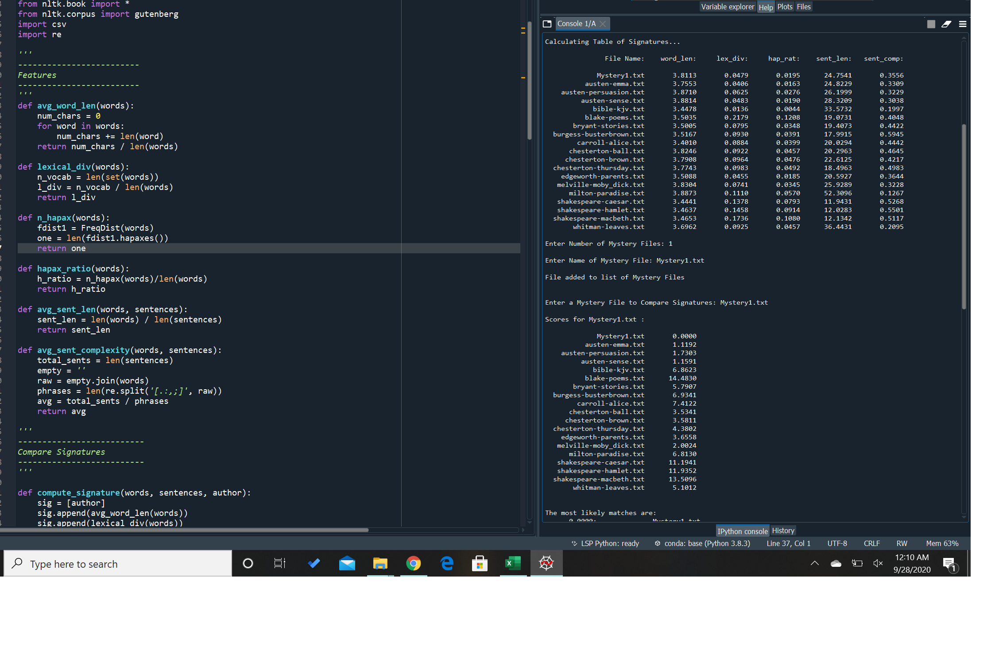

# NLTK-class-project

A class project done along side two other students, the idea behind this project is the program wille calculate certain parameters from info that is passed into it. Using those parameters it will try and guess the author of a book that we give it. The project uses things such as average sentence length, and lexical diversity to try and guess the author. The project also uses Python's Natural language toolkit to parse books from the Gutenburg project.

To run the project, NLTK and its corpora must be downloaded during its first run. Afterwards any mystery novel written by one of the authors in the corpora can be added and it will try to guess which one of the authors wrote the passage or book that you are giving it.

For the project to take a guess at your mystery file, you can add the txt files in the repo to the Gutenberg corpora folder. The program will then prompt you to simply write the name of the file.  

This was my first programming project, and my first python project. I learned how to make sure our methods worked well with each other. It was my first time applying the basics of computer programming to anything bigger than a method. This project is based heavily in linguistics, and I learned much about how we can use programs to parse human speech.
